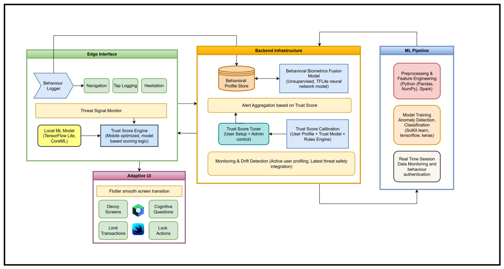

# SecYour SDK 

 

SecYour is a cross-platform **behavioral fraud detection and trust scoring system** for banking applications. It continuously monitors user interaction patterns and device signals to detect anomalies, compute a dynamic **trust score**, and trigger **real-time security actions**.  

## Features  

- **Dynamic Trust Score (0–100)** updated in real-time  
- **TFLite NN Model** (`model_lite.tflite`) predicts expected session trust score  
- **Behavioral Penalties** applied for risky actions (failed PINs, OTP skips, large transactions, etc.)  
- **User Baseline Profiles** created statistically from user sessions for personalized thresholds  
- **Popups when risk is detected**:  
  - ≤20 → **Force Logout**  
  - ≤40 → **OTP Verification**  
  - ≤70 → **Security Question**  
- **Session Log Export** to JSON (secure local storage)  
- **Device & Location Tracking** for contextual analysis  

---

## How It Works  

1. **Session Tracking**
   - Onboarding session logs first usage pattern.
   - SDK logs taps, swipes, navigation, screen visits, transactions, and timing data.  
   - Device info, location, and session metadata are collected.  

3. **ML Regression Model**  
   - Features (e.g., session duration, penalties) are fed into a TensorFlow Lite regression model (`model_lite.tflite`).  
   - The model outputs an **expected trust score baseline**.  

4. **Deviation Detection**  
   - The **Behaviour Manager** compares the model’s prediction with the behavior-adjusted trust score.  
   - If the **deviation is significant**, the system assumes suspicious behavior.  

5. **Risk-Based Actions (Popups)**  
   - Large deviation or low trust score → popup is triggered:  
     - Logout  
     - OTP Verification  
     - Security Question  
   - Trust can be restored after successful re-authentication.  

6. **Baseline Learning**  
   - Every user session, SecYour rebuilds the **user profile baseline** (average tap/swipe speeds).  
   - Future sessions are compared against this baseline for more personalized anomaly detection.  

7. **Log Export & Analytics**  
   - All session data is exported as JSON to `/sdcard/Download/SecYour/` for secure local storage.

## Components  

- **Flutter SDK** → Tracks behaviors, manages trust score, triggers popups  
- **TFLite NN Model (`model_lite.tflite`)** → Predicts baseline trust score  
- **Behaviour Manager** → Applies penalties, compares with ML, enforces actions   

## Tech Stack  

- **Frontend (SDK)**: Flutter (cross-platform: Android, iOS, Web, Desktop)  
- **ML Model**: TensorFlow → TensorFlow Lite (TFLite) NN model  

---

